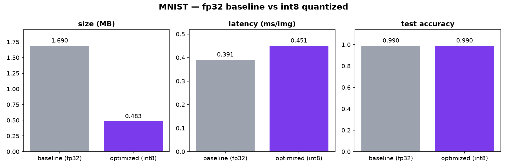
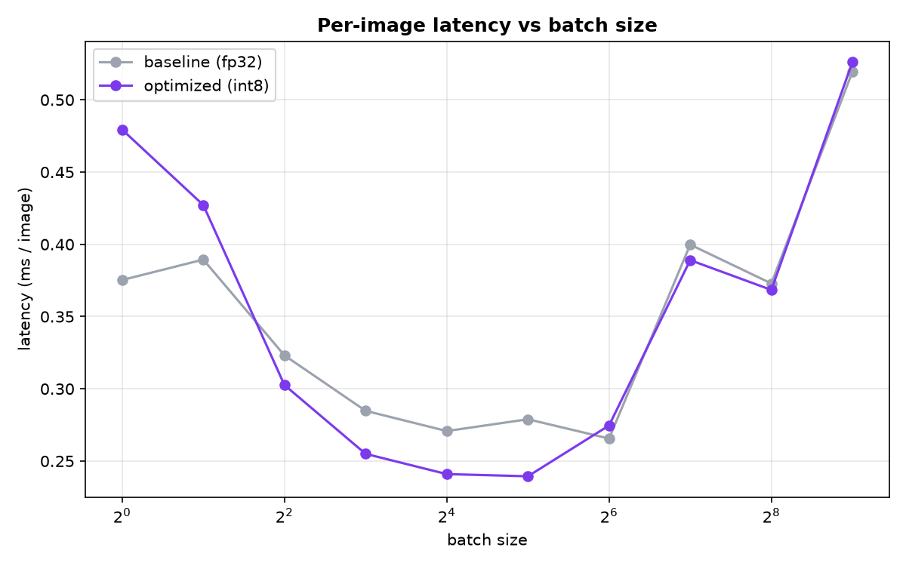

# 01 — MNIST classifier, whittled

## What's here

- **`baseline.py`** -> Trains the fp32 CNN to ~99% test accuracy, saves `mnist_baseline.pt`. 
- **`optimized.py`** -> Loads the baseline, applies int8 dynamic quantization, saves
- **`benchmark.py`** -> Measures size / latency / accuracy for both, prints a table, writes.

Run in order:

```bash
uv run python 01_mnist_classifier/baseline.py    # train + save fp32
uv run python 01_mnist_classifier/optimized.py   # quantize + save int8
uv run python 01_mnist_classifier/benchmark.py    # compare + chart
```
---

## The baseline — and why it's built this way

How the shape of each batch is transformed for training:

```
input          (N, 1, 28, 28)
conv1 -> relu  (N, 32, 28, 28)   3x3 kernel, padding=1 keeps size
maxpool        (N, 32, 14, 14)   halve
conv2 -> relu  (N, 64, 14, 14)
maxpool        (N, 64, 7, 7)     halve again
flatten        (N, 3136)
fc1 -> relu    (N, 128)
fc2            (N, 10)            one raw score per digit
```

**Why these choices:**

- **Convolutions, not just Linear layers.** A digit is made of *local* patterns —
  edges, curves, loops. A conv slides a small window across the image looking for patterns; stacking two conv blocks lets the net get simple features (edges) →
  composite features (loops, junctions). A pure fully-connected net throws that
  spatial structure away.
- **`padding=1` with a 3x3 kernel** keeps height/width constant through the conv, so
  the image only shrinks where we *want* it to (the pooling), not by accident.
- **MaxPool halves the map** after each block — cheaper compute downstream and it makes
  the net care *that* a feature exists, not its exact pixel location.
- **ReLU after every layer except the last.** It's the nonlinearity; without it the
  whole stack collapses into a single linear map and can't learn curved decision
  boundaries. The final `fc2` has **no** activation because `CrossEntropyLoss` expects
  raw scores (logits).
- **Normalize `(0.1307, 0.3081)`** — MNIST's global mean/std. Centering inputs on ~0
  with spread ~1 keeps the training math stable and fast.

**Training:** Adam, `lr=1e-3`, 3 epochs, batch size 64, on GPU. Reaches ~99% test
accuracy. Test set is held out and never trained on — the only honest measure of
whether the net *learned* rather than *memorized*.

---

## The optimization — int8 dynamic quantization

The baseline stores every weight as **fp32** (4 bytes). Quantization re-stores them as
**int8** (1 byte) via a `scale` + `zero_point`:

```
real_value ≈ scale × (int8_value − zero_point)
```

Each float maps to one of 256 integer buckets; the only loss is the rounding into a
bucket. On a robust model like this, that loss is negligible — hence ~zero accuracy
drop.

We use **dynamic** quantization (`quantize_dynamic`): it quantizes the `nn.Linear`
weights ahead of time and computes activation scales on the fly. It's the simplest
form — no calibration data, no retraining.

**Caveat worth knowing:** dynamic quantization only targets `nn.Linear` (and RNNs),
**not** `nn.Conv2d`. That sounds fatal for the size win until you check where the
parameters actually live — the two Linear layers hold ~95% of this model's weights
(`fc1` alone is 3136×128). So quantizing just the Linear layers still yields almost
the full 4x.

---

## Results

Measured on CPU (dynamic-quantized models are CPU-only in PyTorch, so the fp32
baseline is timed on CPU too — a fair, like-for-like comparison), batch size 1.



- **Size: 3.5x smaller** 
- **Accuracy: 0.00 drop**
- **Latency: int8 was ~14% *slower*** 

My prediction is that this is a classic over head vs complexity issue
when the models are small a latency decrease is observed but as model sizes increase
we can see a latency improvement 

### Why int8 came out slower here

Dynamic quantization has **fixed per-inference overhead**: each forward pass it
computes an activation scale, converts fp32→int8, runs the int8 matmul, then converts
back. That overhead only pays off when the matmul is big enough for the cheaper int8
math to outweigh it. This model is tiny and we time at batch size 1, so the overhead
dominates and int8 nets a *loss*. It would flip with a bigger model, a larger
batch, or hardware with optimized int8 kernels (the real-world case: a large model on
a phone).

**Takeaway:** quantization's reliable win is **size and memory bandwidth**. Latency
wins are **conditional** on model scale, batch size, and hardware — not guaranteed.

### Batch-size sweep — testing that prediction

Rather than trust one batch-1 number, `benchmark.py` sweeps batch sizes 1→512 and
measures per-image latency for both models. The prediction (overhead vs. work) holds:



| batch | int8 vs fp32 | what's happening |
|-------|--------------|------------------|
| 1–2 | **slower** (0.78–0.91x) | quant/dequant overhead, no matmul to amortize it over |
| 4–32 | **faster** (up to 1.16x) | matmuls now big enough that cheaper int8 math wins; sweet spot ~8–32 |
| 64–512 | **converge** (~1.0x) | both go memory-bound, and the still-fp32 **conv layers** dominate — quantizing only the Linear layers stops mattering |

**int8 overtakes fp32 at batch ≥ 4.** So the batch-1 result was int8's *worst case*, not
its typical case. The convergence at large batch is its own finding: since dynamic
quantization left the convs in fp32, once convs dominate runtime there's nothing left
to accelerate — you'd need static quantization (which also quantizes conv layers) to
keep winning there.

---

## Possible follow-ups

- Port quantization from the deprecated `torch.quantization` eager API to `torchao`.
- Re-run latency at larger batch sizes to show where int8 starts to win.
- Hand-write the int8 matmul (or mean/std) in C and benchmark against PyTorch —
  a systems exercise, deliberately kept out of this rung's scope.
