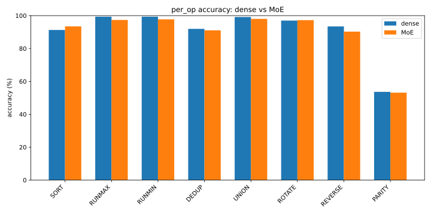
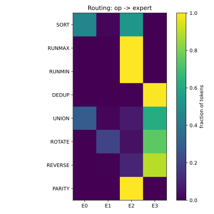
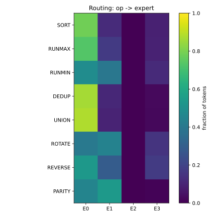
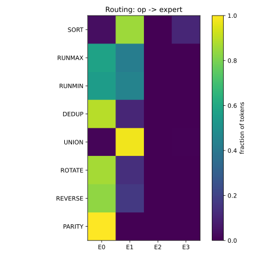
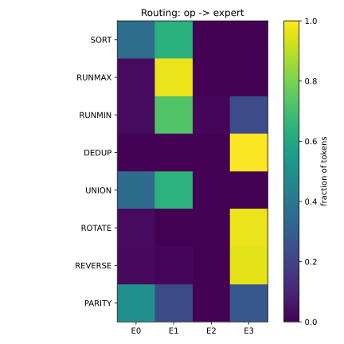
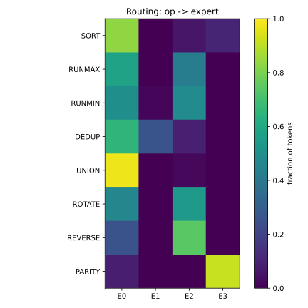

# Do Experts Earn Their Keep? A Controlled Study of Mixture-of-Experts on Algorithmic Tasks

> **Status:** draft. Numbers are from the current multi-seed runs (5 seeds, 8k steps).
> Phase C (load-balanced + kernel-optimized MoE) is not yet included.

## Abstract

I train a small decoder-only transformer to execute eight short list-manipulation
operations selected by a prefix token, and use it as a controlled testbed to ask a
single question: **does a Mixture-of-Experts (MoE) layer earn its cost over a dense
MLP?** Because every target is generated programmatically, accuracy is exact and
measured per operation. Across five seeds I find that a naive top-2 MoE with four
experts is **strictly dominated** by the naive dense model. The MoE has 2.9× the parameters and
1.7× the training time for no accuracy gain, I believe that this is explained by **severe,
stochastic load imbalance**: in most seeds one or more experts collapse to near-zero
utilization. I also find one operation (parity) that neither model learns above
chance. I argue that the promise of MoE at this scale is conditional on (i) sparse
computation and (ii) load balancing, and set up that experiment for future work.

---

## 1. Introduction

Mixture-of-Experts layers are a central tool in scaling modern language models: they
increase parameter count while keeping per-token compute roughly fixed by routing each
token to a small subset of "expert" sub-networks. Most demonstrations are at scale,
where confounds abound. I instead ask the question in a **fully controlled, exactly
gradeable** setting.

I define a family of eight short algorithmic operations over sequences of single
digits (sort, running-max, etc.), these eight operations were further split into 4 families (compare, set, move, reduce), this one done to allow for a logical distribution of tasks amongs the expert. I then select one per example with a prefix token, and train
a dense transformer to produce the answer autoregressively. The data is generated on the
fly, and every answer is checked by the reference implementation, so accuracy is exact and per-operation. This makes it a clean instrument for comparing a
**dense** feed-forward block against a **Mixture-of-Experts** block under matched
training — a comparison studied at scale by Fedus et al. [2], here isolated in a small
controlled setting.

**Contributions.**

1. A controlled dense-vs-MoE comparison with exact, per-operation accuracy over multiple
   seeds.
2. A cost accounting (parameters, training time) showing the naïve MoE is dominated.
3. A routing analysis quantifying expert specialization and **stochastic expert
   collapse** as the mechanism behind the null accuracy result.

---

## 2. Task formulation

Let the digit alphabet be $\Sigma = \{0,\dots,9\}$. I define a set of eight operations

$$\mathcal{O} = \{\,\texttt{SORT},\texttt{RUNMAX},\texttt{RUNMIN},\texttt{DEDUP},\texttt{UNION},\texttt{ROTATE},\texttt{REVERSE},\texttt{PARITY}\,\},$$

each a pure function $o : \Sigma^{n} \to \Sigma^{m}$ (with $m \le n$; parity has
$m=1$). I group them into four loose _families_ — **compare**
(sort, runmax, runmin), **set** (dedup, union), **move** (rotate, reverse), and
**reduce** (parity) — used only for the routing analysis in §6.

An example is the token sequence

$$
x = \big[\,\text{BOS},\; o,\; a_1,\dots,a_n,\; {=},\; b_1,\dots,b_m,\; \text{EOS}\,\big],
\qquad b = o(a),
$$

where the input $a$ has length $n \sim \mathcal{U}\{3,\dots,8\}$ and digits
$a_i \sim \mathcal{U}(\Sigma)$. Sequences are right-padded to a fixed length $T=20$.
The vocabulary $\mathcal V$ has $|\mathcal V| = 22$ tokens: four specials
($\text{PAD},\text{BOS},\text{EOS},{=}$), the ten digits, and the eight operation
names. The **answer region** $\mathcal A \subseteq \{1,\dots,T\}$ marks the positions of
$b_1,\dots,b_m,\text{EOS}$; only these are scored during training and evaluation.

---

## 3. Dense model

I use a pre-norm decoder-only transformer of $L$ layers and width $d$.

**Embedding.** Token and (learned) positional embeddings are summed:

$$h_i^{(0)} = E_{x_i} + P_i, \qquad E \in \mathbb{R}^{|\mathcal V|\times d},\; P \in \mathbb{R}^{T\times d}.$$

**Causal self-attention.** With $Q = hW_Q$, $K = hW_K$, $V = hW_V$,

$$
\mathrm{Attn}(h) = \mathrm{softmax}\!\left(\frac{QK^\top}{\sqrt d} + M\right)V,
\qquad
M_{ij} = \begin{cases} 0 & j \le i \\ -\infty & j > i \end{cases}
$$

The mask $M$ enforces causality: position $i$ attends only to $\{1,\dots,i\}$.
(I use a single attention head.)

**Block.** Each layer applies attention and a feed-forward network, each in a
pre-norm residual branch:

$$
h' = h + \mathrm{Attn}(\mathrm{LN}(h)), \qquad
h'' = h' + \mathrm{FFN}(\mathrm{LN}(h')),
$$

with a two-layer MLP and ReLU nonlinearity and expansion factor 4:

$$
\mathrm{FFN}(z) = W_2\,\mathrm{relu}(W_1 z),
\quad W_1 \in \mathbb{R}^{4d\times d},\; W_2 \in \mathbb{R}^{d\times 4d}.
$$

**Head.** Logits are produced by a final norm and linear map:

$$\ell = \mathrm{LN}(h^{(L)})\,W_{\text{head}}, \qquad W_{\text{head}} \in \mathbb{R}^{d\times|\mathcal V|}.$$

---

## 4. Mixture of Experts

The MoE model is identical except the block's single $\mathrm{FFN}$ is replaced by a
routed mixture of $E$ experts $\{\mathrm{FFN}_e\}_{e=1}^E$, each an independent MLP of
the same shape, following the sparsely-gated MoE layer of Shazeer et al. [1].

**Router.** A linear layer produces per-token scores $s = h W_r \in \mathbb{R}^{E}$.
I keep the top-$k$ experts and softmax over them:

$$
\pi_e =
\frac{\exp(s_e)\,\mathbb{1}\!\left[e \in \mathrm{top}\text{-}k(s)\right]}
     {\sum_{e' \in \mathrm{top}\text{-}k(s)} \exp(s_{e'})}.
$$

Thus $\pi \in \Delta^{E-1}$ with at most $k$ non-zero entries.

**Layer output.** The MoE layer is the gated combination

$$\mathrm{MoE}(h) = \sum_{e=1}^{E} \pi_e \, \mathrm{FFN}_e(h).$$

In this work I use $E = 4$ experts and $k = 2$. **Deliberately, $E < |\mathcal O|$**:
eight operations cannot map one-to-one onto four experts, forcing experts to be shared —
which is what makes the routing analysis in §6 informative.

> **Implementation note.** The current implementation is _naïve_: it evaluates **all**
> $E$ experts and zeroes out the non-selected ones via $\pi$. This costs $E\times$ the
> FFN FLOPs of the dense model rather than the $k\times$ that a sparse implementation
> would achieve. Making the computation genuinely sparse (a fused grouped-matmul kernel)
> is Phase C.

---

## 5. Training objective

I train with next-token prediction, masked to the answer region. For a model with
parameters $\theta$,

$$
\mathcal{L}(\theta) =
-\frac{1}{|\mathcal A|} \sum_{i \in \mathcal A}
\log p_\theta\!\left(x_{i+1} \mid x_{\le i}\right),
$$

i.e. standard cross-entropy applied only at answer positions (the prompt is given, not
predicted). A useful sanity check: an untrained model assigns roughly uniform mass over
$|\mathcal V|$ tokens, so $\mathcal L \approx \log |\mathcal V| = \log 22 \approx 3.09$,
which I observe empirically. I optimize with AdamW (learning rate $10^{-3}$).

---

## 6. Metrics

**Exact-match accuracy.** For operation $o$ with $N_o$ held-out examples, I generate
the answer $\hat y$ autoregressively (greedy) and score exact string match against the
reference $y = o(a)$:

$$\mathrm{acc}_o = \frac{1}{N_o}\sum_{j=1}^{N_o} \mathbb{1}\!\left[\hat y^{(j)} = y^{(j)}\right].$$

**Routing distribution.** For a trained MoE, let $p(e \mid o)$ be the fraction of
answer-region tokens from op-$o$ examples whose top-1 expert is $e$. This yields an
$|\mathcal O| \times E$ matrix (Figure 2).

**Routing entropy.** The concentration of an operation's routing is

$$H(o) = -\sum_{e=1}^{E} p(e \mid o)\,\log p(e \mid o).$$

Low $H(o)$ means op $o$ is handled by few experts (sharp specialization).

**Expert utilization.** The marginal load on expert $e$ is
$U_e = \tfrac{1}{|\mathcal O|}\sum_o p(e\mid o)$. A _dead_ / collapsed expert satisfies
$U_e \approx 0$; perfectly balanced routing would give $U_e = 1/E = 0.25$.

---

## 7. Experimental setup

Both models use $d = 64$, $L = 2$ layers, single-head attention, $T = 20$. The MoE uses
$E = 4$, $k = 2$. Each configuration is trained for **8,000 steps** at batch size 64,
AdamW $10^{-3}$, across **5 seeds** $\{1,\dots,5\}$; for each seed the dense and MoE
models share the seed (identical data stream and comparable initialization), so the only
difference is architecture. Accuracy is measured on 500 held-out examples per model
(fixed evaluation seed, disjoint from training). I report mean $\pm$ standard deviation
over seeds.

---

## 8. Results

### 8.1 Accuracy: dense ≈ MoE

<!-- figures/accuracy.svg -->

| Operation   | Dense (%)  | MoE (%)     |
| ----------- | ---------- | ----------- |
| SORT        | 91.3 ± 7.4 | 93.5 ± 5.3  |
| RUNMAX      | 99.3 ± 0.8 | 97.4 ± 4.5  |
| RUNMIN      | 99.4 ± 0.8 | 97.7 ± 3.0  |
| DEDUP       | 91.9 ± 3.5 | 91.0 ± 3.4  |
| UNION       | 99.2 ± 1.7 | 98.0 ± 1.4  |
| ROTATE      | 97.0 ± 2.7 | 97.3 ± 2.3  |
| REVERSE     | 93.4 ± 8.1 | 90.3 ± 12.6 |
| PARITY      | 51.2 ± 3.1 | 53.2 ± 2.4  |
| **Overall** | **~90.6**  | **~89.8**   |



Per operation, dense and MoE are statistically indistinguishable (differences within one
standard deviation). Two robust observations survive across seeds:

- **Parity is unlearned.** Both models sit at ~53%, i.e. chance for a single-bit output.
  Parity requires aggregating a global XOR over the sequence, which this architecture at
  this scale does not acquire — and, unlike other ops, **more training does not help**.
- **Variance differs by architecture.** Dense is very stable on the monotone ops
  (RUNMAX/RUNMIN, ±0.8) but volatile on SORT (±7.4); the MoE is more volatile on REVERSE
  (±12.6). The two architectures have different _failure modes_, not different means.

> **A note on rigor.** An earlier single-seed run at fewer steps showed large per-op
> swings (e.g. DEDUP 62.7 vs 41.8). Multi-seed evaluation revealed these were training
> noise: at 8k steps over 5 seeds the gap closes to 91.9 vs 91.0. This is the value of
> multi-seed evaluation, and a caution against reading single runs.

### 8.2 Cost: the MoE is dominated

| Model | Parameters | Training time (s) |
| ----- | ---------- | ----------------- |
| Dense | 104,214    | 60.5 ± 1.6        |
| MoE   | 303,262    | 102.0 ± 3.0       |

The naïve MoE uses **2.9× the parameters** and **1.7× the wall-clock training time** for
**no accuracy benefit**. On this task, at this scale, it is a strictly worse choice.

### 8.3 Routing: specialization vs. collapse

<!-- figures/routing_avg.svg + figures/routing_seed*.svg -->

Per-seed expert utilization $U_e$ (fraction of answer-region tokens per expert;
balanced ideal = 0.25):

| Seed | $U_0$ | $U_1$ | $U_2$ | $U_3$ | collapsed ($U_e < 0.02$) |
| ---- | ----- | ----- | ----- | ----- | ------------------------ |
| 1    | 0.10  | 0.035 | 0.44  | 0.42  | 0 (E1 near-dead)         |
| 2    | 0.65  | 0.25  | 0.00  | 0.095 | 1                        |
| 3    | 0.56  | 0.42  | 0.00  | 0.016 | 2                        |
| 4    | 0.14  | 0.43  | 0.002 | 0.43  | 1                        |
| 5    | 0.58  | 0.032 | 0.33  | 0.06  | 0 (E1 near-dead)         |

**Heat map for MoE Seed0**



**Heat map for MoE Seed1**



**Heat map for MoE Seed2**



**Heat map for MoE Seed3**



**Heat map for MoE Seed4**



The routing is **never balanced**. Individual experts range from $0.00$ to $0.65$
against the uniform ideal of $0.25$. In **3 of 5 seeds** at least one expert is fully
collapsed; in the remaining two, one expert is near-dead ($U_e \approx 0.03$).
**Which** expert collapses is seed-dependent (E2 in seeds 2–4; E1 near-dead in 1, 5).

This is the mechanism behind §8.2: with one or two experts contributing nothing, the MoE
operates with an effective capacity of roughly $\tfrac{2}{4}$–$\tfrac{3}{4}$ of its
parameters, so its extra parameters do not translate into accuracy. The specialization
the architecture was designed to exhibit is present in tendency (some experts clearly
own more mass) but is overwhelmed by imbalance in the absence of any balancing pressure.

---

## 9. Discussion

The headline is a _negative_ result stated precisely: **a naïve top-2 MoE does not earn
its cost on this task.** This is not evidence against MoE in general; it isolates the two
ingredients a fair MoE needs, both currently missing:

1. **Sparse computation.** The naïve layer computes all $E$ experts. A correct sparse
   MoE computes only $k$, making per-token FFN cost $k/E = 1/2$ of the naïve version and
   comparable to dense. Realizing this requires a grouped/ragged matmul kernel.
2. **Load balancing.** The stochastic collapse in §8.3 is the Ill-known failure mode of
   unregularized routing. An auxiliary load-balancing loss encourages
   $U_e \to 1/E$, recovering the wasted capacity.

The clean experiment is therefore: add both, and re-measure whether the **optimized** MoE
closes the accuracy gap _and_ undercuts the dense model's cost.

---

## 10. Limitations

- **Scale.** One task family, $d=64$, $L=2$, single head, 5 seeds. Conclusions are about
  this regime, not MoE at scale.
- **Naïve MoE.** Cost numbers reflect the dense-compute implementation; a sparse kernel
  changes the compute story (§9).
- **Out-of-distribution.** Inputs are length 3–8 by construction; the model fails on
  lengths 1–2 it never saw — it learns the training distribution, not the abstract
  algorithm.
- **Single-layer routing analysis.** Routing statistics are collected at the first block
  only.

---

## 11. Future work (Phase C)

- Add an auxiliary load-balancing loss; re-measure utilization $U_e$ and per-op accuracy.
- Implement a fused grouped-matmul (`ragged_dot`) kernel so the top-2 MoE is genuinely
  sparse; benchmark tokens/sec vs. the naïve layer and vs. dense.
- Report the dense vs. naïve-MoE vs. optimized-MoE comparison on the same axes
  (accuracy, parameters, training and inference cost).

---

## Reproduction

```bash
uv run pytest 02_moe_instruction_follower          # 72 tests
uv run python 02_moe_instruction_follower/results.py   # tables + figures
```

Figures are written to `figures/` (`accuracy.svg`, `routing_avg.svg`,
`routing_seed{0..4}.svg`).

---

## References

[1] N. Shazeer, A. Mirhoseini, K. Maziarz, A. Davis, Q. Le, G. Hinton, J. Dean.
_Outrageously Large Neural Networks: The Sparsely-Gated Mixture-of-Experts Layer._
ICLR 2017. arXiv:1701.06538. — the top-$k$ gated MoE layer used here.

[2] W. Fedus, B. Zoph, N. Shazeer. _Switch Transformers: Scaling to Trillion Parameter
Models with Simple and Efficient Sparsity._ JMLR 2022. arXiv:2101.03961. — dense vs.
sparse-MoE comparison and load balancing at scale.

<!-- Verify arXiv IDs against arxiv.org before publishing. -->
