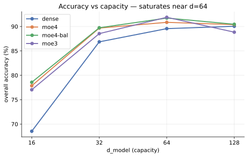
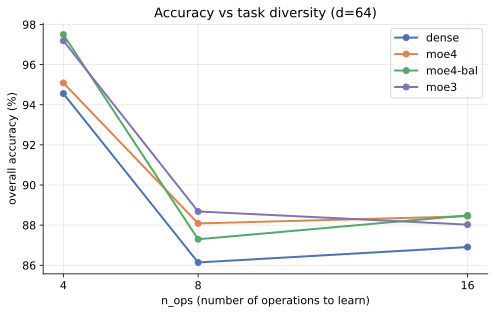
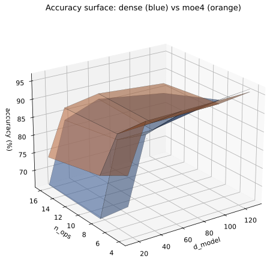
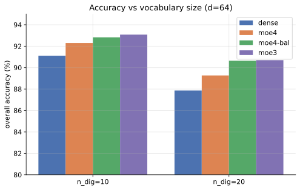
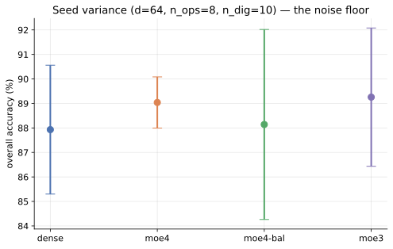
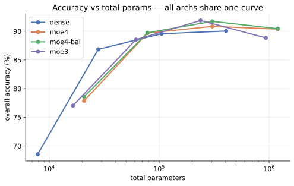
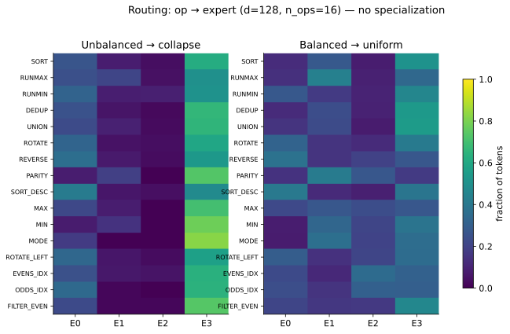
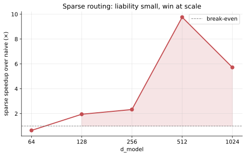

# MoE Instruction-Follower: Findings

A controlled study of a from-scratch Mixture-of-Experts transformer against a
dense baseline on a synthetic list-operation task. The goal is not to argue that
one architecture is "better"; it is to hold every variable fixed except the one
under test, sweep all variations, and report what actually happened and why.

All numbers below come from `datasheet.jsonl` (346 runs). Every figure is
regenerated from that file by `report_figures.py`; the sparse-vs-naive
benchmark is the measured output of `app.py bench` on the dev GPU.

---

## 1. Method

**Design.** A full grid over four factors, with four architectures:

| Factor                 | Values                              |
| ---------------------- | ----------------------------------- |
| architecture           | dense · moe4 · moe4-balanced · moe3 |
| d_model (capacity)     | 16, 32, 64, 128                     |
| n_ops (task diversity) | 4, 8, 16                            |
| n_dig (vocabulary)     | 10, 20                              |
| seed                   | 1, 2, 3, 4                          |

Training budget is fixed at 8000 steps for every run.

**Controls.** All architectures share the same task, tokenizer, optimizer
(AdamW, lr 1e-3), batch size, training budget, and data generator. The _only_
difference is the feed-forward block: a dense MLP versus a router that selects
`top_k=2` of `n_experts` MLPs. `moe4` = 4 experts, `moe3` = 3 experts,
`moe4-balanced` = 4 experts with the load-balancing auxiliary loss switched on.

**Isolating a variable.** To read one factor's effect I report **marginal
means**: accuracy averaged over every other factor. This is only honest if the
grid is balanced, which it is (86-87 runs per architecture).

**Metrics.** overall accuracy (fraction of _fully_ correct outputs), held-out
loss, total vs. active parameters, wall-clock train time, inference tokens/sec,
and two routing-health numbers (utilization entropy, dead-expert count).

**Why this task.** Every example is generated and graded programmatically
(`SORT 4 5 2 1 = 1 2 4 5`), so there is no dataset and no label noise, so
accuracy is exact, and difficulty and capacity can be dialed independently. That control
is the whole point; the cost is that the task is small, which matters for the
interpretation throughout.

---

## 2. Effect of capacity (d_model)

| d_model | dense | moe4 | moe4-bal | moe3 |
| ------: | ----: | ---: | -------: | ---: |
|      16 |  68.5 | 77.9 |     78.6 | 77.0 |
|      32 |  86.9 | 89.7 |     89.7 | 88.5 |
|      64 |  89.6 | 90.9 |     91.7 | 91.9 |
|     128 |  90.0 | 90.4 |     90.5 | 88.8 |

Accuracy rises steeply from d=16 to d=64 (+21 pts for dense) and then plateaus;
d=128 is within noise of d=64. **The task saturates near d=64.**

The architecture gap is largest exactly where capacity is scarce (d=16: MoE
+9 pts) and disappears once capacity exceeds what the task needs (d=128:
90.0 vs 90.4). This is not evidence that MoE is a better learner; it is what
you would expect from a model that carries more parameters (§6) being compared
at equal `d_model`. When capacity is the bottleneck, more parameters win; past
saturation, the architecture stops mattering.

---

## 3. Effect of task diversity (n_ops)

Marginal means at d=64:

| n_ops | dense | moe4 | moe4-bal | moe3 |
| ----: | ----: | ---: | -------: | ---: |
|     4 |  94.6 | 95.1 |     97.5 | 97.2 |
|     8 |  86.1 | 88.1 |     87.3 | 88.7 |
|    16 |  86.9 | 88.4 |     88.5 | 88.0 |

More operations to learn in a fixed budget lowers accuracy, with the sharpest
drop from 4→8 ops (−8 pts). The MoE edge is small (~+1.5 pts) and roughly
constant across difficulty; adding experts did not make the harder,
more-diverse settings disproportionately easier, which is the first hint that
the experts are not carving the task up by operation (§7).

The two capacity/diversity factors together trace a surface. dense (blue) and
moe4 (orange) sit almost flush across the whole grid: the orange sheet floats
just above the blue one at the low-capacity edge and merges with it everywhere
else, the same story as §2 in one picture:

---

## 4. Effect of vocabulary (n_dig)

Marginal means at d=64:

| n_dig | dense | moe4 | moe4-bal | moe3 |
| ----: | ----: | ---: | -------: | ---: |
|    10 |  91.1 | 92.3 |     92.8 | 93.1 |
|    20 |  87.9 | 89.3 |     90.6 | 90.7 |

Doubling the digit vocabulary costs ~3 pts across the board, more embeddings to
learn and fewer training examples per token. The MoE variants degrade slightly
less (dense −3.2 vs moe3 −2.4), but the difference is within the noise floor
established next.

---

## 5. Seed variance: the noise floor

The same configuration (d=64, n_ops=8, n_dig=10) across seeds:

| arch     | mean |  std |
| -------- | ---: | ---: |
| dense    | 87.9 | 2.63 |
| moe4     | 89.0 | 1.04 |
| moe4-bal | 88.1 | 3.88 |
| moe3     | 89.3 | 2.82 |

**Run-to-run standard deviation is 1-4 points.** This is the single most
important control in the study: any accuracy difference smaller than ~3 pts is
indistinguishable from seed noise. Most of the MoE-over-dense gaps at d≥64 fall
inside this band and should not be read as real. The one place the gap clearly
exceeds noise is the capacity-starved regime (d=16, §2).

---

## 6. Parameters vs. active parameters

Parameter budgets at d=64:

| arch     | total params | active params |
| -------- | -----------: | ------------: |
| dense    |      104,926 |       104,926 |
| moe4     |      303,974 |       171,622 |
| moe4-bal |      304,010 |       171,658 |
| moe3     |      237,704 |       171,528 |

An MoE layer holds ~3× the parameters of the dense layer but only activates
~1.6× of them per token (top_k=2 of 4 experts). Plotting accuracy against
**total** parameters, the four architectures fall on essentially **one shared
curve**; the MoE points do not sit above the dense trend. In other words, at
this scale MoE buys no accuracy per parameter that the parameter count alone
does not already explain; its distinguishing structural property is simply that
most of its parameters are dormant on any given token. That dormancy is the
premise for the compute results in §8. This matches the original motivation for
sparse MoE: decoupling parameter count from per-token compute [1, 2].

---

## 7. Routing behavior: no operation-level specialization

Averaged routing health across all runs with routing recorded:

| arch     | dead experts | routing entropy | uniform ceiling |
| -------- | -----------: | --------------: | --------------: |
| moe4     |         0.79 |           0.893 |           1.386 |
| moe4-bal |         0.26 |           1.074 |           1.386 |
| moe3     |         0.28 |           0.736 |           1.099 |

The natural hope is that experts specialize: that one expert learns "sorting"
and another learns "filtering." **They do not.** Two regimes appear, neither of
them specialization:

- **Unbalanced → collapse.** Left alone, routing entropy sits well below the
  uniform ceiling. In the hardest runs (d=128, n_ops=16) all sixteen
  operations route to a single expert; one expert does the work and the others
  atrophy (mean 0.79 dead experts). That is degeneration, not division of labor.
- **Balanced → uniform.** The load-balancing loss lifts entropy to ~1.07, near
  the uniform ceiling of 1.386: every operation now sprays roughly evenly across
  all four experts (heatmap right). Utilization is healthy (dead experts drop to
  0.26) but any structure is gone by construction; the loss explicitly
  rewards uniformity.

Crucially, balancing improves utilization but **not accuracy** (§2: moe4 vs
moe4-bal are within noise). The auxiliary loss is doing exactly its job [2] and
nothing more. The honest reading: interpretable, operation-level specialization
did not emerge at this scale and diversity, consistent with reports that expert
routing in trained MoEs is largely non-semantic and not cleanly interpretable
[2, 3].

---

## 8. Compute cost and the sparse kernel

**The naive cost.** At d=64 the MoE is ~1.6× more expensive than dense (train
131 s vs 80 s, inference 85 vs 135 tok/s), because the naive forward runs
every expert on every token and discards the unused outputs. Held-out loss
is marginally lower for MoE (0.044 vs 0.054), but not enough to justify the cost
at this size.

**Recovering the sparsity.** `sparse.py` implements the forward the routing
actually implies: gather only the selected (token, expert) pairs, sort by
expert, run one grouped matmul (`jax.lax.ragged_dot`) so each expert sees only
its tokens, then scatter the results back. It is verified equal to the naive
path to `6.6e-7`.

Wall-clock speedup of sparse over naive (`app.py bench`, dev GPU):

| d_model |    64 |   128 |   256 |   512 |  1024 |
| ------: | ----: | ----: | ----: | ----: | ----: |
| speedup | 0.65× | 1.95× | 2.33× | 9.76× | 5.72× |

At small width the gather/sort/scatter overhead costs more than the sparsity
saves, so sparse is _slower_. The break-even is around
d=128, and by d=512 sparse is ~10× faster, because the naive path's "run every
expert" cost (and the memory to materialize every expert's activations) grows
with width while the sparse path stays proportional to the tokens actually
routed. The regime where the routing overhead is fully dwarfed by the compute
saved lies beyond single-GPU reach here; the measured trend points that way, but
the asymptote is an extrapolation, not a measurement. This is the same
observation that motivates expert-parallel sharding at large scale [1, 4].

---

## 9. Summary of variable effects

| Variable       | Direction on accuracy    | Magnitude                 | Note                              |
| -------------- | ------------------------ | ------------------------- | --------------------------------- |
| d_model ↑      | rises, then plateaus ~64 | +21 pts (16→64), ~0 after | task saturates                    |
| n_ops ↑        | falls                    | −8 pts (4→16)             | harder                            |
| n_dig ↑        | falls                    | −3 pts (10→20)            | more embeddings                   |
| dense → MoE    | rises                    | +1-2 pts, +9 only at d=16 | mostly within noise               |
| balance loss   | flat                     | ~0                        | fixes _utilization_, not accuracy |
| seed           | n/a                      | ±1-4 pts                  | the noise floor                   |
| naive → sparse | (compute)                | 0.65× → 9.76×             | liability small, win at scale     |

**What the data supports, stated plainly.** On this task, at this scale, MoE is
not a better model than the dense baseline; matched by total parameters it
sits on the same accuracy curve, its apparent wins are mostly within seed noise,
and its experts do not specialize. What it is, is a different compute
structure: most of its parameters are inactive per token, and the sparse kernel
turns that dormancy into a real wall-clock win, but only once the model is wide
enough for the saved compute to outweigh the routing overhead. Everything here
is a small-scale measurement; the interesting behavior is what it implies as the
scale grows past what a single GPU can show.

---

## References

1. Shazeer et al., "Outrageously Large Neural Networks: The Sparsely-Gated
   Mixture-of-Experts Layer," 2017.
2. Fedus, Zoph, Shazeer, "Switch Transformers: Scaling to Trillion Parameter
   Models with Simple and Efficient Sparsity," 2021.
3. Jiang et al., "Mixtral of Experts," 2024 (routing analysis: expert
   assignment shows little semantic/domain specialization).
4. Lepikhin et al., "GShard: Scaling Giant Models with Conditional Computation
   and Automatic Sharding," 2020.
